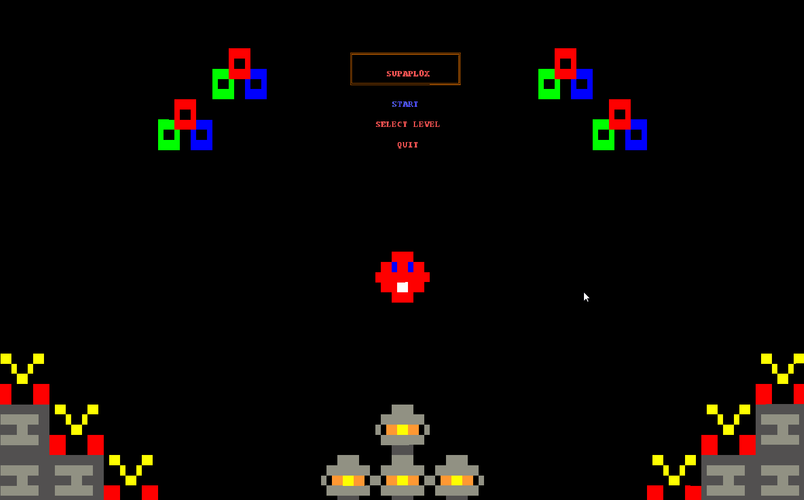
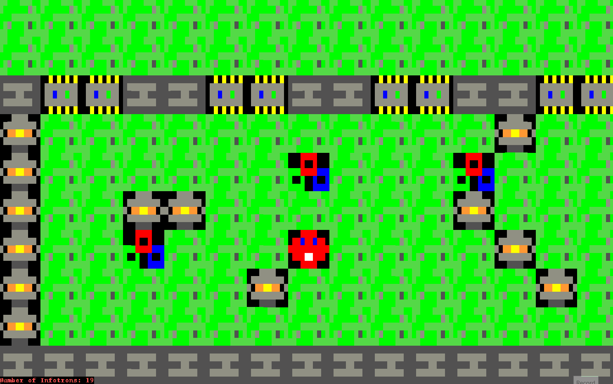
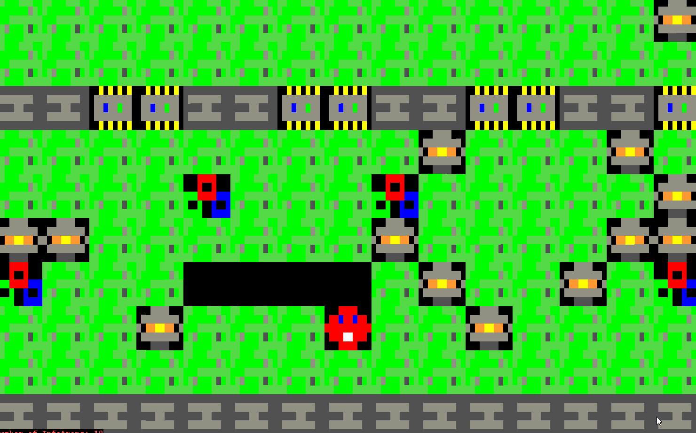
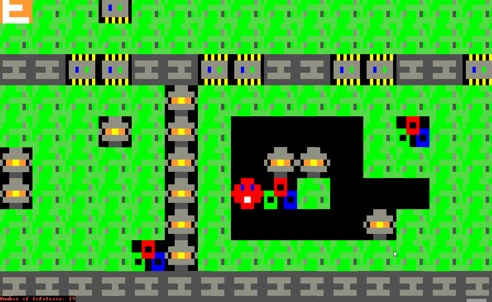
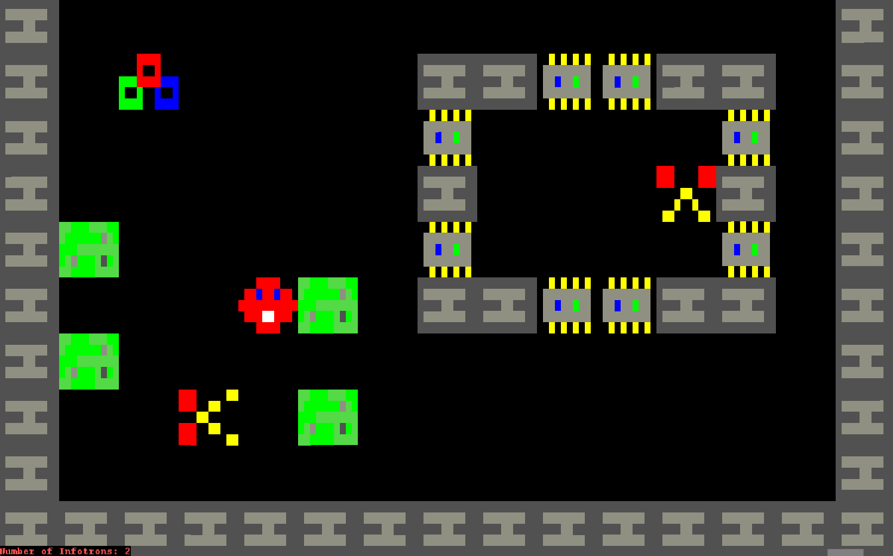
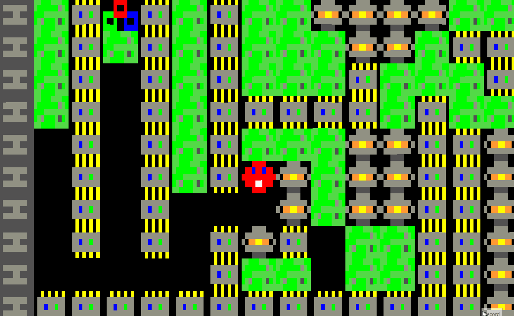
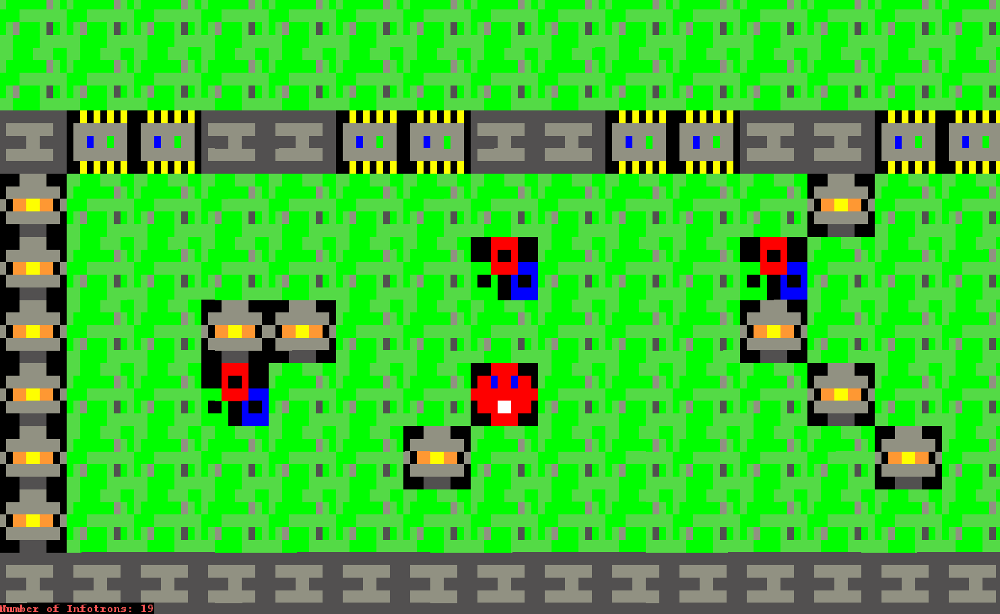

## LTDS_<T>08_<G>801 - <GameName> Supapl0x

The project is a clone of the 90's game Supaplex. We play as Murphy, a very brave and adventurous red ball on a mission to capture Infotrons. During his
quest he's faced with a series of challenges in the form of mazes which he must go through in order to find the Infotrons he needs. The mazes are dangerous
places, filled with scissors which can cut Murphy down, and rocks which can crush him. Murphy must use his environment wisely to beat his challenges and
reach the much desired EndBlock which takes him back home with his loot.

This project was developed by Fábio Sá (up202007658@edu.fe.up.pt), Pedro Barbeira (up201303693@edu.fe.up.pt) and José Diogo (202003529@edu.fe.up.pt) for LDTS 21/22.

### CONTROLS:

#### - MOVEMENT 
- **MOVE UP** - Arrow Up (↑)
- **MOVE DOWN** - Arrow Down (↓)
- **MOVE LEFT** - Arrow Left (←)
- **MOVE RIGHT** - Arrow Right (→)

#### - EATING
- **EAT UP** - CTRL + Arrow Up (↑)
- **EAT DOWN** - CTRL + Arrow Down (↓)
- **EAT LEFT** - CTRL + Arrow Left (←)
- **EAT RIGHT** - CTRL + Arrow Right (→)

#### - OTHERS

- **PAUSE** - p
- **RESTART** - r

### MAIN MENU AND SELECT LEVEL MENU DEMONSTRATION

### LEVEL_01 PLAYING AND COMPLETION

### LEVEL_02 PLAYING AND COMPLETION

### MURPHY MOVEMENT AND EATING FEATURE

### BEHAVIOUR OF ROCKS

### BEHAVIOUR OF SCISSORS

### PAUSE MENU FEATURE

### RESTART FEATURE

### SELF-EVALUATION

- Fábio Sá: 33.(3) %
- Pedro Barbeira: 33.(3) %
- José Diogo: 33.(3) %