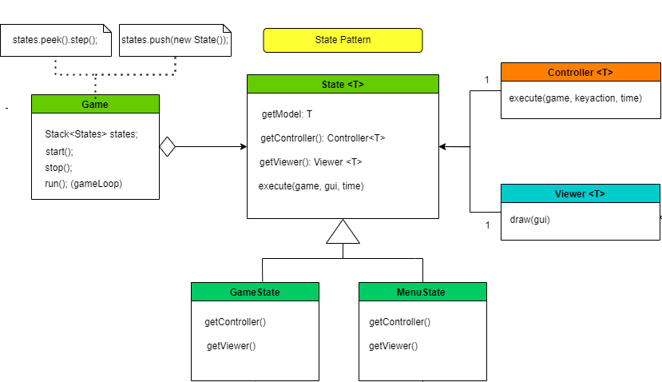
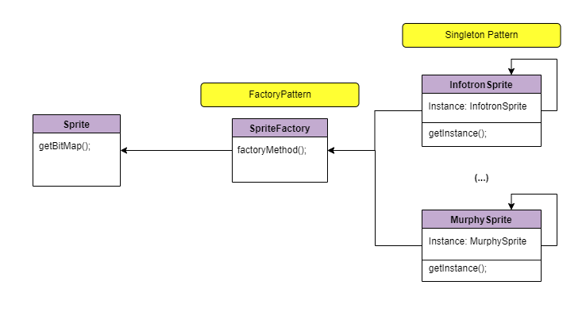
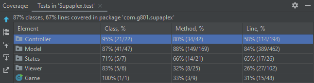
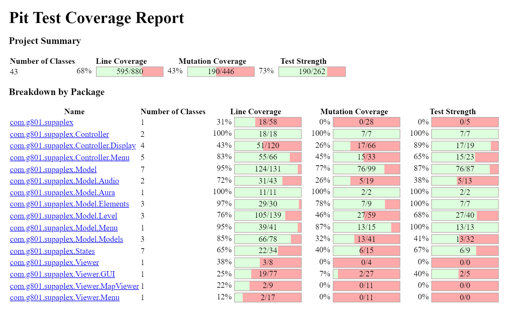
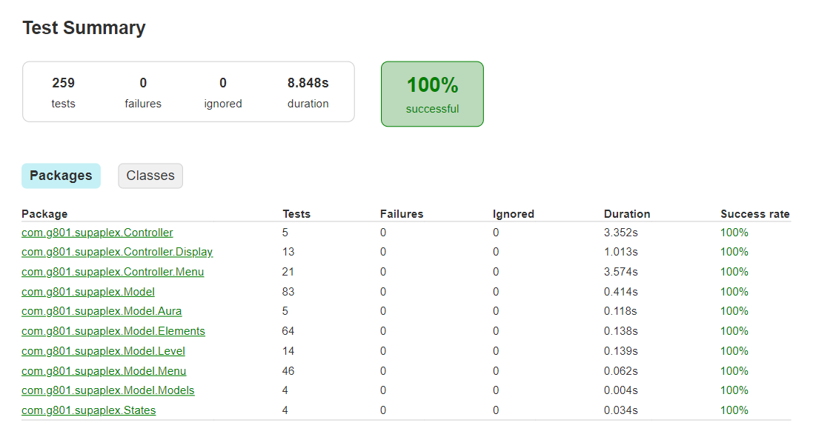

## LTDS_<T>08_<G>801 - <GameName> Supapl0x

The project is a clone of the 90's game Supaplex. We play as Murphy, a very brave and adventurous red ball on a mission to capture Infotrons. During his
quest he's faced with a series of challenges in the form of mazes which he must go through in order to find the Infotrons he needs. The mazes are dangerous
places, filled with scissors which can cut Murphy down, and rocks which can crush him. Murphy must use his environment wisely to beat his challenges and
reach the much desired EndBlock which takes him back home with his loot.
We choose to clone this classic game because 
- 1) the graphical interface is suitable to implement in Lanterna;
- 2) there are different blocks with
different behaviors - Murphy is player controlled, Scissors are NPCs with a crude form of AI, and Rocks are an environment block which can be moved. This
allows us to go through different implementation challenges and apply different Design Patterns, thus increasing the learning experience.

This project was developed by Fábio Sá (up202007658@edu.fe.up.pt), Pedro Barbeira (up201303693@edu.fe.up.pt) and José Diogo (202003529@edu.fe.up.pt) for LDTS 21/22.

### IMPLEMENTED FEATURES

- **Game Logic** - We have most of the code logic behind most of the planned features (about the game flow) in a good position.
- **Menus** - Basic Layout for menus, including Main, Level Select and Pause.
- **States** - Stack Structure to allow simple application flow.
- **Pause Menu** The user is able to take a break and pick off right where he left the game, or simply restart the current level.
- **Move** - Murphy will move according to the arrow key pressed by the user (up, down, left, right)
- **Eat** - The player can make Murphy eat an adjacent block without moving into it by pressing CTRL + ARROW
- **Unit Collision** - Murphy can't move against walls, Rocks and Scissors can only move if there's no block in front of them.
- **Specific Behavior** - Rocks which can't be moved act as Walls and Scissors rotate when moving forwards isn't possible.
- **Infotron Counter** - Murphy needs a certain number of Infotrons to beat each level
- **Fall** - Rocks will fall if there's no supporting block underneath them, also they can fall sideways (right/left) if the block
    underneath them is also a Rock.
- **Restart** - Allows the user to restart the game at any given point.
- **Sounds** - Different sounds for some animations (for example, when murphy captures an Infotron).
- **Sprites** - Our different game elements are drawn using multiple 2D arrays of chars (or a bitmap), in order to allow the design
-   of more complex images.

------
### DESIGN

#### APPLICATION FLOW

##### Problem in context

There was the need to switch between levels, menus and splash menus, each with their own respective controller and viewer.

##### The Pattern

In order to guarantee our application to have a good flow, we implemented the [**State Pattern**](https://refactoring.guru/design-patterns/state). This pattern allows us to keep state-specific behaviors inside different subclasses that represent different states. We can switch to a different state of the application by pushing another implementation to the stack (i.e., another subclass).
It also provides a simple way to implement some features, for example the Pause Menu, in which the current state is the game one, we simply push a PauseMenuState, and then when the user wants to return to the game, simply pop the stack.
This pattern enabled us to address the identified problems because it allowed us to keep the game states in a stack located in the Game class, eliminating the need to use switch operators, and making the change in state much easier to handle.

### Implementation



Some classes where we implemented this pattern are the following:

- [State](../src/main/java/com/g801/supaplex/States/State.java)
- [GameState](../src/main/java/com/g801/supaplex/States/GameState.java)
- [MainMenuState](../src/main/java/com/g801/supaplex/States/MenuState.java)

### CONSEQUENCES

Localizes and partitions behavior for different states.
Makes state transitions easier and more explicit.

#### REPETITION OF OBJECTS

##### Problem in Context

Having multiple instances of certain objects could take up an unnecessary amount of memory while running. For example, the Sprites of each Model are presets,
and one instance of a Model (say, a Wall) will always have the same Sprite. Having to create a new Sprite every time we created a new Model object would not
only overload the memory with repeated objects but also require memory access through file reading, which would affect the system's performance.

##### The Pattern

To solve this, we applied the Singleton Pattern. By making each Sprite a Singleton we ensured that the file would only be read upon initialization, and each
object could get its corresponding Sprite through the getInstance() method. In fact, we implemented the Singleton Pattern in many more objects throughout
our game (some of which gave rise to other problems which will be discussed further down).

##### Implementation

Singletons were implemented using the standard Singleton template (although some had to be slightly modified, as we'll soon expose). Each object has a private
field of its own type, and a private constructor which initializes it. Instances of the object can be retrieved through the getInstance() method, which calls the private constructor if the field hasn't been initialized yet.

##### Examples: 

- [Colors](../src/main/java/com/g801/supaplex/Model/Colors.java)
- [Sprites](../src/main/java/com/g801/supaplex/Model/Models/SpriteFactory.java)

```java
class InfotronSprite extends Sprite {

    private static InfotronSprite sprite;

    private InfotronSprite(){
        Reader.fillSprite("Infotron", this);
    }

    public static InfotronSprite getInstance(){
        if (sprite == null)
            sprite = new InfotronSprite();
        return sprite;
    }
}
```

**Consequences**

The use of the [**Singleton**](https://refactoring.guru/design-patterns/singleton) Pattern provided the following benefits:
- There's only one possible instance of objects which are singular in the system (Sprites, Murphy, GameScreen, Display)
- Since the getInstance() method is a public static we can easily access the instance in any layer of the system without having to pass it as a parameter
- Changes in a Singleton ripple throughout the whole system, therefore a change made at the Model Level will also be accessible at the View Level, and so
  on and so forth

However, there were certain drawbacks:

- Constructors where private, therefore couldn't receive parameter arguments
- Certain objects (Murphy, GameScreen, Display) have to be reset after each level, therefore, despite our initial intentions, it's hard to implement a Singleton Pattern
  for them.
-------
#### CREATING SEVERAL INHERITED OBJECTS

**Problem in Context**

Our system is reading the Sprite information from a text document which contains a text image drawn with characters, each of which represent a color, as
in a bitmap. The Map information was stored in the same way, but instead of a color each character represented a type of Model. We had to find a way to
quickly translate the characters into color codes, in the first case, or into Models, in the second case. The same problem showed up in the Controller
layer, when parsing the user input to figure out which Action would Murphy do.

**The Pattern**

This is almost a textbook application of the Factory pattern. We applied different factories, which would either return the proper Strings (color), the
proper Bitmap for the Models (SpriteFactory).

**Implementation**



Again, we followed the standard Factory template. Here are the snippets:

##### SPRITE FACTORY
```java
public class SpriteFactory {

    public static Sprite factoryMethod(char c) {
        return switch (c) {
            case 'W' -> WallSprite.getInstance();
            case 'B' -> BaseSprite.getInstance();
            case 'C' -> ChipSprite.getInstance();
            case 'E' -> EndSprite.getInstance();
            case 'M' -> MurphySprite.getInstance();
            case 'I' -> InfotronSprite.getInstance();
            case 'X' -> ScissorsSprite.getInstance();
            case 'O' -> RockSprite.getInstance();
            default  ->  null;
        };
    }
}
```

##### CONSEQUENCES

- Adding a new color, a new Model or a new Action to our system would require minimal effort, since the factory would handle the creation.
- We could freely use inheritance without having to instantiate new objects "by hand" each time we had to.
- We kept the code readable and free from long conditional chains.

------

### MVC (Model-View-Controller)

#### Problem in context

We had to separate the data, interface and control of the game for organization’s sake and to have a more **reusable,
modular and easy to implement code**. This architectural pattern complies with the **Single Responsibility Principle**
assuring the separation of functions between classes.

#### The Pattern

The [**MVC architectural pattern**](https://www.freecodecamp.org/news/the-model-view-controller-pattern-mvc-architecture-and-frameworks-explained/) is a way to separate all the code in three elements, Model, View and Control. The Model
does not have dependencies, the View depends on the Model, and the Controller depends on both the Viewer and Model.

The model only represents the data. The view displays the model data, and sends user actions to the controller. The
controller provides model data to the view, and interprets user actions.

#### Implementation 

- [Model](../src/main/java/com/g801/supaplex/Model)
- [Controller](../src/main/java/com/g801/supaplex/Controller)
- [Viewer](../src/main/java/com/g801/supaplex/Viewer)

#### Consequences

- Using MVC (our professor recommendation) was a crucial part of our project, since it allowed us to manage our code and 
time more efficiently, since it allowed each of us to work on different parts (backend/frontend) simultaneously, without depending so much on the other fields of code.
- The program became easier to modify and test, derived from the isolated nature of the different elements.

### KNOWN CODE SMELLS AND REFACTORING SUGGESTIONS

#### USAGE OF SWITCH CASE

We are using it for example in our [LanternaGUI](../src/main/java/com/g801/supaplex/Viewer/GUI/LanternaGUI.java) 
or in our Menu Controllers (e.g. [MainMenuController](../src/main/java/com/g801/supaplex/Controller/Menu/MainMenuController.java)) to handle inputs from the user,
although it is generally considered a bad practice, we think it keeps the code more organized and readable.

#### USING A DATA CLASS (Class that only exists to store variables)

We are aware that we currently have this smell in our code, but we choose to keep it like this, since this class is used 
by [Configuration](../src/main/java/com/g801/supaplex/Model/Configuration.java), which is a pretty big class on its own.

```java
class ScreenSettings {
    
public static final Integer x = 5;   //How many blocks to the side of murphy
public static final Integer y = 3;
public Integer yMin;
public Integer yMax;
public Integer xMin;
public Integer xMax;

}
```

#### LARGE CLASS

The way our class [Display](../src/main/java/com/g801/supaplex/Model/Level/Display.java) is set up at the moment, it's handling a lot of features, 
for example initially rendering the level, updating the visible portion of the game map and also updating the relative positions of the different
game elements.

A possible solution is to use the **Extract class** technique of refactoring, 
but the Display class makes more sense if it is done like this and also dividing into subclasses would make for larger function chains.

#### LONG METHOD

We consider our Render() method inside [Display](../src/main/java/com/g801/supaplex/Model/Level/Display.java) to be a long method,
which means that it has too many lines of code, making it harder to read.

Although it's a long method, we don't have any duplicate code inside it, so our solution would be to extract some code into
smaller and more concise methods.

----

### TESTING

- Screenshot of coverage report.



- Screenshot of Mutation Testing:



- Screenshot of Tests Summary:



### SELF-EVALUATION

- Fábio Sá: 33.(3) %
- Pedro Barbeira: 33.(3) %
- José Diogo: 33.(3) %