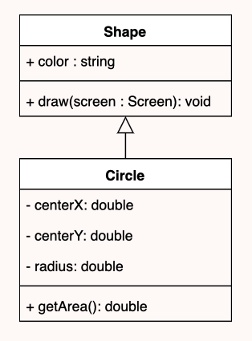
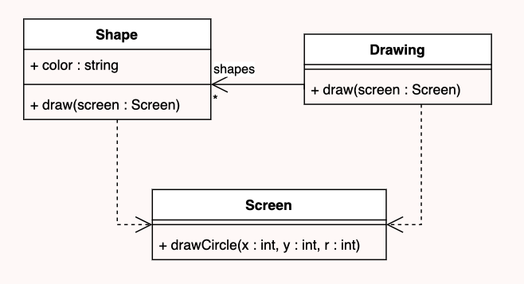
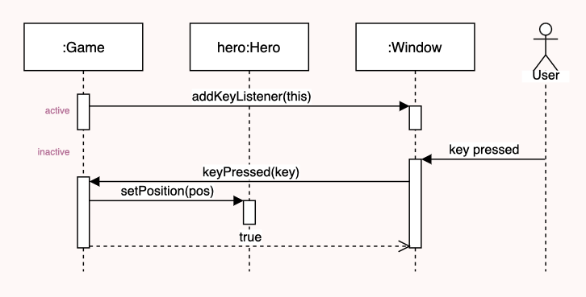

# UML

Diagramas que representam a estrutura e o comportamento da aplicação. Podem ser de três tipos principais:

- [x] Class Diagrams;
- [x] Sequence Diagrams;
- [x] State Diagrams;

## 1 - Class Diagrams

Representa as classes e relação entre elas, bem como indicação das operações e dos atributos de cada uma.
Modelação conceptual do domínimo do software e os seus componentes.
A representação de cada classe vai ao encontro do que se aprende em Base de Dados:

 

  

 

Tópicos relevantes:  
- Para classes ou métodos abstractos, usar os seus nomes em *itálico*;  
- Cada método ou atributo é precedido por um símbolo. São eles:  
  - "+", se o método ou atributo for público;  
  - "-", se o método ou atributo for privado;  
  - "*", se o método ou atributo for protegido;  
- A estrutura para cada linha será sempre   `symbol methodName(listParameter : parameterType) returnType`;  
- Há associações bidirecionais (por padrão) e associações unidirecionais, com a seta a apontar para o objecto que conhece;  
- As interfaces possuem <<"Interface">> antes do nome da tabela e as suas implementações são sinalizadas por uma seta a tracejado;  
- As dependências também são identificadas por uma seta a tracejado, a apontar para a parte necessária;  

 

  

 

## 2 - Sequence Diagrams

Representa a interação entre objectos numa ordem sequencial  

- Lifeline - representa o tempo sequencial (uma linha do tempo)
- Actors - qualquer entidade externa que interaja com o sistema
- Message - traduzida por uma seta preenchida ou tracejada
- Activation - retângulo em cima da lifeline que representa o período que demora a processar o pedido

 

  

 

## 3 - State Diagrams

### Credits:  
[UML Class Diagrams](https://web.fe.up.pt/~arestivo/presentation/uml-classes/#1), by André Restivo  
[UML Sequence Diagrams](https://web.fe.up.pt/~arestivo/presentation/uml-sequence/#1), by André Restivo  

**@ Fábio Araújo de Sá**  
**2021/2022**